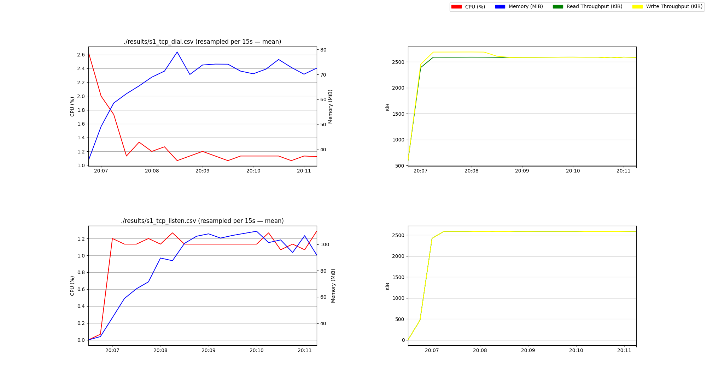
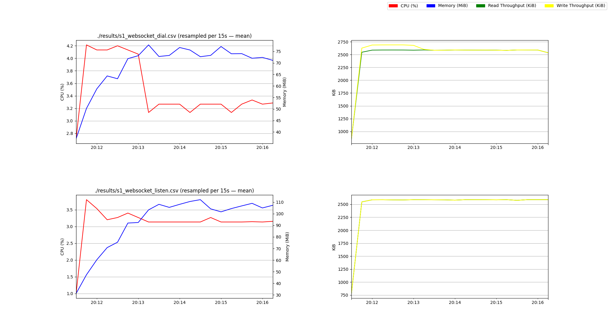
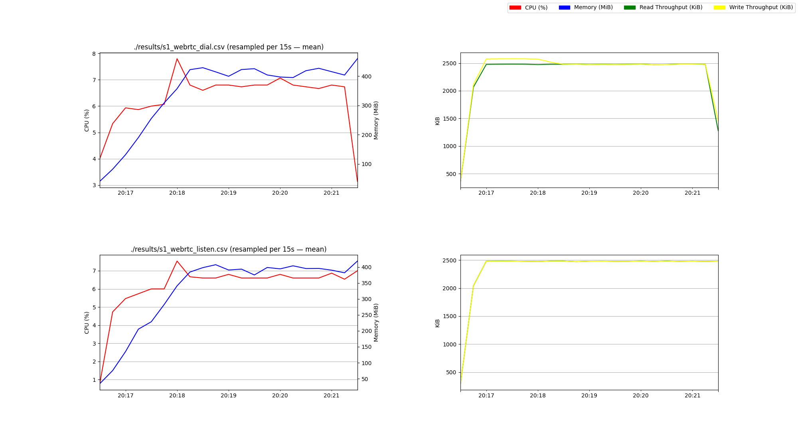
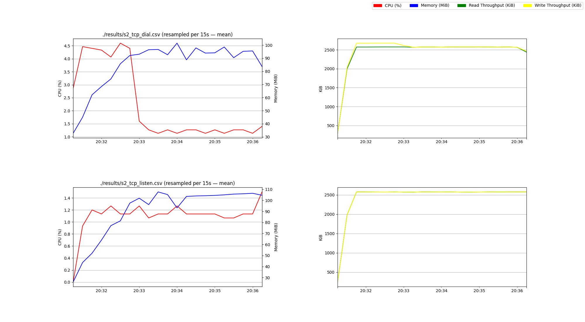
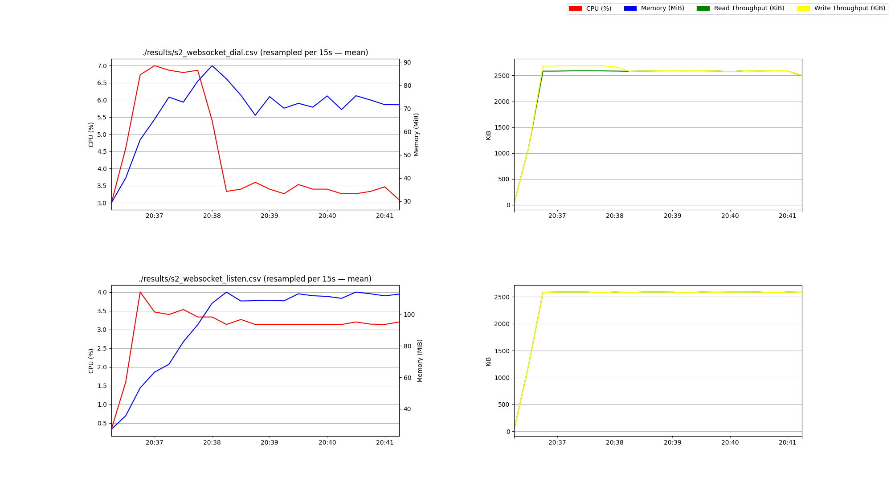
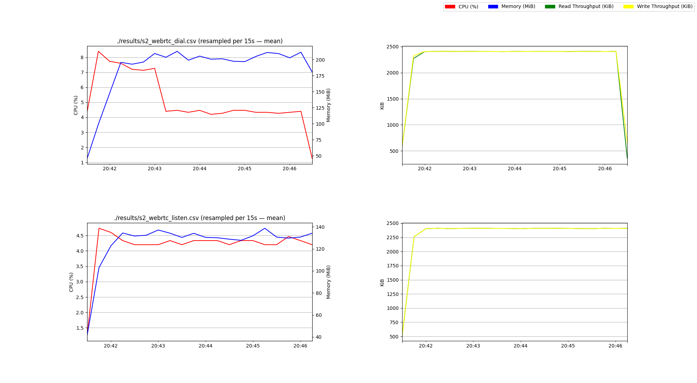
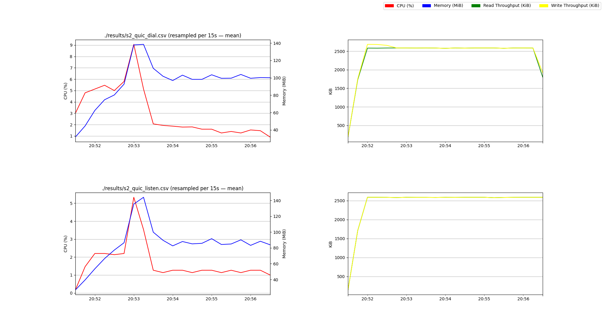
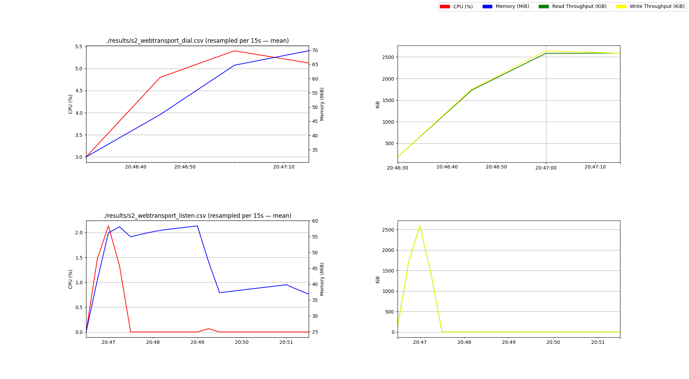

# WebRTC Transport Benchmarks

This directory contains a benchmarking tool and instructions how to use it,
to measure the performance of the WebRTC transport.

- [1. Instructions](#1-instructions)
  - [1.1. Listener](#11-listener)
    - [1.1.1. Metrics](#111-metrics)
  - [1.2. Client](#12-client)
  - [1.3. Profile](#13-profile)
- [2. Benchmarks](#2-benchmarks)
    - [2.1. Scenario 1](#21-scenario-1)
        - [2.1.1. Results](#211-results)
    - [2.2. Scenario 2](#22-scenario-2)
        - [2.2.1. Results](#221-results)

## 1. Instructions

In this section we'll show you how to run this benchmarking tool on your local (development) machine.

1. Run a listener
2. Run a client

What you do next to this depends on what you're after.

- Are you using it to get metrics from a standard and well defined cloud run?
- Are you using it to get metrics from your local machine?
- Are you using it to (Go) profile one or multiple things?

With that in mind, we'll show you how to do all of the above.

### 1.1. Listener

Run:

```
go run ./main.go -metrics csv listen
```

This should output a multiaddr which can be used by the client to connect.
Other transport values supported instead of `webrtc` are: `tcp`, `quic`, `websocket` and `webtransport`.

The listener will continue to run until you kill it.

#### 1.1.1. Metrics

The metrics can be summarized using the `report` command:

```
go run ./main.go report -s 16 metrics_listen_webrtc_c2_s8_e1_p0.csv
```

Which will print the result to the stdout of your terminal.
Or you can visualize them using the bundled python script:

```
./scripts/visualise/visualise.py metrics_listen_webrtc_c2_s8_e1_p0.csv -s 16
```

Which will open a new window with your graph in it.

More useful is however to save it to a file so we can share it. For the WebRTC results of Scenario 1
we might for example use the following command:

```
 ./scripts/visualise/visualise.py \
    -s 10000 \
    -o ./images/s1_webrtc.png \
    ./results/metrics_dial_webrtc_c10_s100_p0.csv \
    ./results/metrics_listen_webrtc_e1_p0.csv
```

### 1.2. Client

Run:

```
go run ./main.go -c 2 -s 8 dial <multiaddr>
```

You can configure the number of streams and connections opened by the dialer using opt-in flags.

The client will continue to run until you kill it.

> Tip:
> 
> similar to the `listen` command you can also use the `-metrics <path>.csv` flag to output the metrics to a file.

### 1.3. Profile

Profiling the benchmark tool is supported using the Golang std pprof tool.

E.g. you can start your listener (or client) with the `-profile 6060` flag to enable profiling over http.

With your listener/client running you can then profile using te std golang tool, e.g.:

```
# get cpu profile
go tool pprof http://localhost:6060/debug/pprof/profile

# get memory (heap) profile
go tool pprof http://localhost:6060/debug/pprof/heap

# check contended mutexes
go tool pprof http://localhost:6060/debug/pprof/mutex

# check why threads block
go tool pprof http://localhost:6060/debug/pprof/block

# check the amount of created goroutines
go tool pprof http://localhost:6060/debug/pprof/goroutine
```

It will open an interactive window allowing you to inspect the heap/cpu profile, e.g. to see te top offenders
of your own code by focussing on the relevant module (e.g. `top github.com/libp2p/go-libp2p/p2p/transport/webrtc`).

And of course you can also use the `-pdf` flag to output it to a file instead that you can view in your browser or
any other capable pdf viewer.

## 2. Benchmarks

The goal of this tooling was to be able to benchmark how the WebRTC transport performs on its own
as well as compared to other transports such as QUIC and WebTransport. Not all scenarios which are benchmarked
are compatible with the different transports, but WebRTC is tested on all benchmarked scenarios.

The scenarios described below and the results you'll find at the end are ran on / come from two c5 large EC2 instances.
Each instance has 8 vCPUs and 16GB RAM. More information can be found at:
https://aws.amazon.com/ec2/instance-types/c5/

Dream goal for WebRTC in terms of performance is to consume 2x or less resources compared to quic. For [Scenario 2](#22-scenario-2) the results are currently as follows when comparing WebRTC to quic:


**Scenario 1:**

1. Server, on EC2 instance A, listens on a generated multi address.
2. Client, on EC2 instance B, dials 10 connections, with 1000 streams per connection to the server.

**Scenario 2:**

1. Server, on EC2 instance A, listens on a generated multi address.
2. Client, on EC2 instance B, dials 100 connections, with 100 streams per connection to the server.

For both scenarios the following holds true:

- Connections are ramped up at the rate of 1 connection/sec. 
- Streams are created at the rate of 10 streams/sec.
- This is done to ensure the webrtc transport's inflight request limiting does not start rejecting connections.
- The client opens streams to the server and runs the echo protocol writing 2KiB/s per stream (1 KiB every 500ms).
- We let the tests run for about 5 minute each.

The instances are running each scenario variation one by one, as such there at any given moment only one benchmark script running.

### 2.1. Scenario 1

Server:

```
go run ./scripts/multirunner listen
```

Client:

```
go run ./scripts/multirunner dial
```

#### 2.1.1. Results

**All transports in function of CPU and Memory**


**TCP**



|                          | s1_tcp_dial.csv | s1_tcp_listen.csv |
|----------------------|-------------------|-----------------|
|              **CPU (%)** |                 |                   |
|                      min |                0|                  0|
|                      max |                0|                  3|
|                      avg |                0|                  1|
|    **Memory Heap (MiB)** |                 |                   |
|                      min |            0.000|             67.151|
|                      max |            143.747|            0.000|
|                      avg |            0.000|            103.907|
|     **Bytes Read (KiB)** |                 |                   |
|                      min |           2527.000|            0.000|
|                      max |            0.000|           2590.000|
|                      avg |            0.000|           2588.290|
|  **Bytes Written (KiB)** |                 |                   |
|                      min |           2527.000|            0.000|
|                      max |            0.000|           2590.000|
|                      avg |            0.000|           2588.290|

**WebSocket (WS)**



|                          | s1_websocket_dial.csv | s1_websocket_listen.csv |
|----------------------|-----------------------|-------------------------|
|              **CPU (%)** |                       |                         |
|                      min |                      0|                        3|
|                      max |                      0|                        5|
|                      avg |                      0|                        3|
|    **Memory Heap (MiB)** |                       |                         |
|                      min |                   67.891|                  0.000|
|                      max |                  0.000|                  146.493|
|                      avg |                  0.000|                  106.615|
|     **Bytes Read (KiB)** |                       |                         |
|                      min |                  0.000|                 2473.000|
|                      max |                  0.000|                 2590.000|
|                      avg |                  0.000|                 2587.361|
|  **Bytes Written (KiB)** |                       |                         |
|                      min |                  0.000|                 2473.000|
|                      max |                  0.000|                 2590.000|
|                      avg |                  0.000|                 2587.361|


**WebRTC**



|                          | s1_webrtc_dial.csv | s1_webrtc_listen.csv |
|----------------------|--------------------|----------------------|
|              **CPU (%)** |                    |                      |
|                      min |                   0|                     5|
|                      max |                  10|                    10|
|                      avg |                   5|                     6|
|    **Memory Heap (MiB)** |                      |                    |
|                      min |             270.316|               265.111|
|                      max |             556.074|               527.543|
|                      avg |             426.373|               393.691|
|     **Bytes Read (KiB)** |                    |                      |
|                      min |               0.000|              2398.000|
|                      max |            2482.000|              2482.000|
|                      avg |            2134.703|              2478.026|
|  **Bytes Written (KiB)** |                    |                      |
|                      min |               0.000|              2398.000|
|                      max |              2482.000|            2521.000|
|                      avg |            2140.396|              2478.026|

### 2.2. Scenario 2

Server:

```
go run ./scripts/multirunner listen
```

Client:

```
go run ./scripts/multirunner -s 1 dial
```

#### 2.2.1. Results

**All transports in function of CPU and Memory**


**TCP**



|                          | s2_tcp_dial.csv | s2_tcp_listen.csv |
|----------------------|-----------------|-------------------|
|              **CPU (%)** |                 |                   |
|                      min |                1|                  0|
|                      max |                7|                  4|
|                      avg |                  1|                2|
|    **Memory Heap (MiB)** |                   |                 |
|                      min |           23.210|             22.941|
|                      max |          126.677|            143.747|
|                      avg |           85.917|             90.692|
|     **Bytes Read (KiB)** |                 |                   |
|                      min |            9.000|              0.000|
|                      max |         2612.000|           2580.000|
|                      avg |         2480.470|           2473.094|
|  **Bytes Written (KiB)** |                 |                   |
|                      min |            9.000|              0.000|
|                      max |         2681.000|           2581.000|
|                      avg |         2509.758|           2473.094|

**WebSocket (WS)**



|                          | s2_websocket_dial.csv | s2_websocket_listen.csv |
|----------------------|-----------------------|-------------------------|
|              **CPU (%)** |                       |                         |
|                      min |                      2|                        0|
|                      max |                        6|                      9|
|                      avg |                        3|                      4|
|    **Memory Heap (MiB)** |                         |                       |
|                      min |                 23.790|                   23.415|
|                      max |                115.189|                  152.205|
|                      avg |                 71.235|                   96.166|
|     **Bytes Read (KiB)** |                       |                         |
|                      min |                 10.000|                    0.000|
|                      max |               2590.000|                 2590.000|
|                      avg |                 2484.513|               2492.197|
|  **Bytes Written (KiB)** |                       |                         |
|                      min |                 10.000|                    0.000|
|                      max |               2693.000|                 2590.000|
|                      avg |               2521.583|                 2484.513|

**WebRTC**



|                          | s2_webrtc_dial.csv | s2_webrtc_listen.csv |
|----------------------|----------------------|--------------------|
|              **CPU (%)** |                    |                      |
|                      min |                     0|                   0|
|                      max |                  10|                     5|
|                      avg |                   1|                     4|
|    **Memory Heap (MiB)** |                    |                      |
|                      min |              27.324|                24.450|
|                      max |             281.883|               184.007|
|                      avg |             202.546|               126.187|
|     **Bytes Read (KiB)** |                      |                    |
|                      min |               0.000|                 0.000|
|                      max |            2410.000|              2468.000|
|                      avg |             737.878|              2315.657|
|  **Bytes Written (KiB)** |                      |                    |
|                      min |               0.000|                 0.000|
|                      max |              2467.000|            2511.000|
|                      avg |              2315.657|             740.010|

**QUIC**



|                          | s2_quic_dial.csv | s2_quic_listen.csv |
|----------------------|--------------------|------------------|
|              **CPU (%)** |                  |                    |
|                      min |                 0|                   0|
|                      max |                11|                   7|
|                      avg |                 2|                   1|
|    **Memory Heap (MiB)** |                  |                    |
|                      min |            27.506|              24.056|
|                      max |           197.098|             185.402|
|                      avg |            96.260|              85.729|
|     **Bytes Read (KiB)** |                  |                    |
|                      min |             0.000|               0.000|
|                      max |          2588.000|            2598.000|
|                      avg |          2139.380|            2484.218|
|  **Bytes Written (KiB)** |                  |                    |
|                      min |               0.000|             0.000|
|                      max |          2699.000|            2598.000|
|                      avg |          2155.807|            2484.218|

**WebTransport**



|                          | s2_webtransport_listen.csv | s2_webtransport_dial.csv |
|----------------------|----------------------------|--------------------------|
|              **CPU (%)** |                            |                          |
|                      min |                           0|                         2|
|                      max |                           4|                         8|
|                      avg |                           0|                         4|
|    **Memory Heap (MiB)** |                            |                          |
|                      min |                    22.984|                      22.773|
|                      max |                      79.518|                    89.429|
|                      avg |                      47.088|                    55.111|
|     **Bytes Read (KiB)** |                            |                          |
|                      min |                       0.000|                    11.000|
|                      max |                    2590.000|                  2590.000|
|                      avg |                     290.694|                  1963.886|
|  **Bytes Written (KiB)** |                            |                          |
|                      min |                    11.000|                       0.000|
|                      max |                    2591.000|                  2692.000|
|                      avg |                  1991.272|                     290.694|

